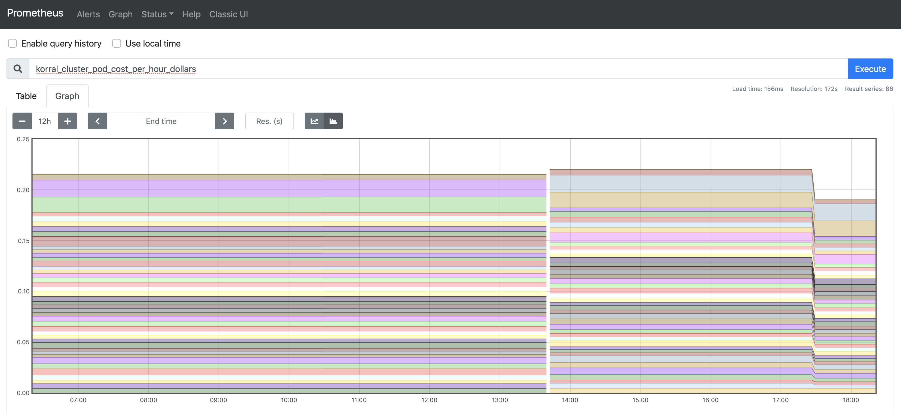

## Kubernetes cluster cost metrics

Korral collects Kubernetes cluster cost metrics and provides them to Prometheus. Currently, on AWS, GCP, and Azure.

The exported metrics structure adheres to Prometheus [best practices](https://prometheus.io/docs/practices/naming/) where metrics are exposed on fine granularity level, then aggregation is performed in Prometheus. There are two facets though to help users write simpler queries:

1. Cluster level where cost is provided on cluster object level: node, node volumes, load-balancers, etc.;
2. Pod level where cost is per pod and includes pod volumes. Costs that cannot be reliably attributed to a specific pod is amortized across all pods (in a namespace, on a node). For example, ingress controller load-balancer and it's egress traffic cost or node boot volume cost.

In both cases, the metrics are measured in USD per hour. The Sum of all metrics in a facet should add up to the total cluster cost, modulo rounding errors. Note that orphan volumes costs are not included in _Pod level_ facet.

### Cluster level

- `korral_cluster_node_cost_per_hour_dollars` - cluster node cost without cost of attached volumes, split by `node` tag
- `korral_cluster_node_volumes_cost_per_hour_dollars` - cluster node attached volumes cost, spilt by `node` tag; this includes Kubernetes volumes attached to the node and node boot volume
- `korral_cluster_loadbalancer_cost_per_hour_dollars` - cluster loadbalancer cost, split by `hostname`
- `korral_cluster_loadbalancer_taffic_cost_per_hour_dollars` - cluster loadbalancer ingress/egress traffic and LCUs cost, split by `hostname`
- `korral_cluster_orphaned_volumes_cost_per_hour_dollars` - cluster volumes that exist but not used if any, split by `claim_namespace`, `claim` tags if corresponding PVC exists
- `korral_cluster_k8s_cost_per_hour_dollars` cluster cloud provider cost if any, ie. $0.10 per hour for EKS cluster; `0` is reported if there is no additional cost.

### Pod level

- `korral_cluster_pod_cost_per_hour_dollars` - pod cost without cost of attached volumes, split by `name`, `pod_namespace`, `node` tags
- `korral_cluster_pod_volumes_cost_per_hour_dollars` - pod volumes cost if any, split by `name`, `pod_namespace`, `node` tags.

Additionally, if `--labels=` flag is specified (the default is `pod_owner,release,app.kubernetes.io/name`), then each pod metric get the requested labels copied from the pod. `pod_owner` is a special case - the collector will traverse Kubernetes resource hierarchy to determine top-most _controller_ resource name to assign to the label (name of deployment, statefulset, etc.). If no label set on the pod/deployment then '(none)' will be set as label value to simplify Prometheus queries.

The cost model makes a few arbitrary assumptions:

1. A sum of pod containers `resources.requests` is used to determine pod share of node total cost. If no `requests` are available, then `limits` are used, else `{ cpu: '100m', memory: '32Mi' }`. RAM cost is 23% of instance cost; this is more or less true for AWS _General Purpose_ instance types. Thus the cost will change as pods are rescheduled.
2. Cost of node volumes that are not Kubernetes volumes is amortized across pods on that particular node.
3. Load-balancer cost is spread across namespace pods evenly. There should be at least one pod.
4. Cluster cloud provider cost (if any, EKS $0.10) is spread across all pods.
5. Only `Running` pods are counted.
6. Orphan volumes costs are not attributed to any pod.

### Quickstart

In case you have Node.js installed, do `npm install` and then run `korral`:

    ./korral print

    Cluster:
        Total:   0.19298 USD per hour
        Nodes:   0.0459
        Volumes: 0.02208
                 0.00125 Kubernetes
                 0.02082 boot
        ELBs:    0.025
        K8s:     0.1

Set `KUBECONFIG` and/or supply `--context=` to change cluster. Call `./korral help` for details.

If you have Docker instead, you may want to try something along these lines:

    docker run --rm \
        -v ${KUBECONFIG:-$HOME/.kube/config}:/kubeconfig -e KUBECONFIG=/kubeconfig \
        agilestacks/korral print

You must map your cloud credentials into the container, ie. `AWS_*`, `GOOGLE_APPLICATION_CREDENTIALS`, or `AZURE_*` vars. No `aws-iam-authenticator` nor AWS CLI is present in the image so for EKS it's easier to start on Node.js path.

### Installation and configuration

[install/kubernetes.yaml](https://github.com/agilestacks/korral/blob/master/install/kubernetes.yaml) configures service account with restricted privileges, installs the deployment, and Prometheus Operator [ServiceMonitor](https://github.com/prometheus-operator/prometheus-operator/blob/master/Documentation/design.md) custom resource.

Installed on the cloud-native Kubernetes (EKS, GKE, AKS) it will automatically determine cloud API to use. If you have your own Kubernetes flavor, please add `--cloud=aws|gcp|azure` to deployment `args`.

> The default scrape timeout for Prometheus is 10 seconds. If your exporter can be expected to exceed this, you should explicitly call this out in your user documentation.

Installed Prometheus `ServiceMonitor` custom resource configures the timeout to 20sec. You may want to change that.

